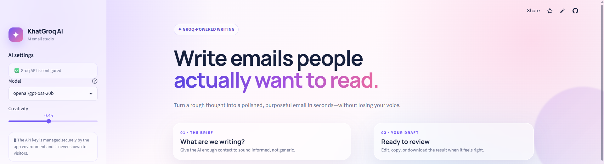
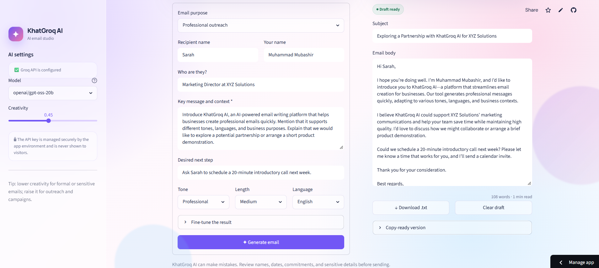

# KhatGroq AI

> A fast, polished AI email generator built with Streamlit and Groq.

KhatGroq AI turns a short brief into a professional, editable email in seconds. It combines Groq-powered generation with a responsive glassmorphism interface designed for business outreach, follow-ups, meeting requests, customer support, and more.



## Features

- Generate complete emails with a subject line, greeting, body, and sign-off.
- Choose the purpose, tone, length, language, and creativity level.
- Add recipient details, business context, a call to action, and custom instructions.
- Edit the generated subject and body directly in the app.
- Download the finished draft as a `.txt` file or copy a ready-to-send version.
- Keep the Groq API key on the server—visitors never see or enter it.
- Use a responsive glass-style interface on desktop and smaller screens.
- Receive clear feedback for missing configuration, authentication errors, and rate limits.

## App preview

### From brief to business-ready email

Fill in a focused brief on the left and review the generated draft on the right. The output remains fully editable before it is copied or downloaded.



## Tech stack

- **Frontend and application:** [Streamlit](https://streamlit.io/)
- **AI inference:** [Groq](https://groq.com/)
- **Language:** Python
- **Configuration:** `python-dotenv` locally and Streamlit Secrets in production

## Run locally

### 1. Clone the repository

```bash
git clone <your-repository-url>
cd <repository-folder>
```

### 2. Create a virtual environment

Windows PowerShell:

```powershell
python -m venv .venv
.\.venv\Scripts\Activate.ps1
```

macOS or Linux:

```bash
python3 -m venv .venv
source .venv/bin/activate
```

### 3. Install dependencies

```bash
pip install -r requirements.txt
```

### 4. Configure Groq

Copy `.env.example` to `.env`, then add your Groq API key:

```env
GROQ_API_KEY=gsk_your_key_here
```

Alternatively, create `.streamlit/secrets.toml`:

```toml
GROQ_API_KEY = "gsk_your_key_here"
```

Never commit `.env`, `.streamlit/secrets.toml`, or an API key to Git.

### 5. Start the app

```bash
streamlit run app.py
```

Open `http://localhost:8501` in your browser.

## Deploy on Streamlit Community Cloud

1. Push the project to a GitHub repository.
2. In [Streamlit Community Cloud](https://share.streamlit.io/), create an app from that repository.
3. Select `app.py` as the entrypoint.
4. Open **Advanced settings** and select **Python 3.12**.
5. Add the following in the **Secrets** field:

   ```toml
   GROQ_API_KEY = "gsk_your_key_here"
   ```

6. Save the settings and deploy the app.

If an existing deployment uses another Python version, recreate the deployment with Python 3.12. Python versions cannot be changed in place on Streamlit Community Cloud.

## Project structure

```text
.
├── .streamlit/
│   └── config.toml       # Streamlit theme and server settings
├── app.py                # Application UI and Groq integration
├── img1.png              # Landing-page screenshot
├── img2.png              # Generated-email screenshot
├── requirements.txt      # Pinned Python dependencies
├── .env.example          # Local environment template
└── README.md
```

## Security notes

- The API key is loaded from the app environment and is not exposed as a user input.
- `.env` and `.streamlit/secrets.toml` are excluded through `.gitignore`.
- Generated emails should be reviewed for names, dates, commitments, and sensitive details before sending.

## License

This project does not currently include a license. Add a `LICENSE` file before distributing or accepting external contributions.
